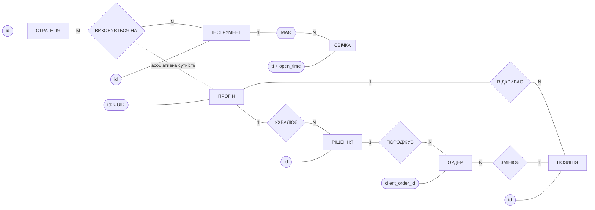
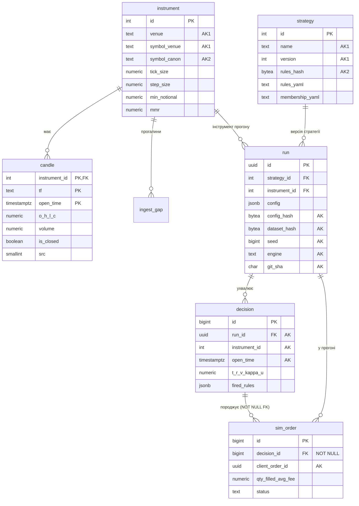

# Модель даних FuzzHelm: три рівні (ПР10)

Документ для розділу звіту про базу даних. Модель подано на трьох рівнях: концептуальному (ER у нотації Чена,
7 сутностей), логічному (реляційна схема, нормалізація до 3НФ, розв'язання M:N) і фізичному (DDL PostgreSQL 16,
індекси, права). Фізичний рівень збігається з нормативним DDL брифінгу §6 з однією свідомою відмінністю
(`sim_order.decision_id NOT NULL`, ST-01). Це перевіряє тест, а не ручна звірка
(`tests/integration/test_migrations.py::test_migrated_schema_matches_brief_ddl`).

---

## 1. Концептуальна модель (ER, нотація Чена)

### 1.1 Сутності

| Сутність | Тип | Ключ | Зміст |
|---|---|---|---|
| **ІНСТРУМЕНТ** | сильна | id (природний: біржа + символ біржі; канонічний символ) | контракт: крок ціни/кількості, мін. номінал, ставка підтримувальної маржі, макс. плече |
| **СВІЧКА** | **слабка** (існує лише в межах інструмента) | частковий ключ: таймфрейм + час відкриття | OHLCV, VWAP, к-сть угод, джерело (WS/REST/REPLAY), ознака закриття, скор аномалії |
| **СТРАТЕГІЯ** | сильна | id (природний: назва + версія; хеш правил) | база правил Мамдані (YAML) + функції належності (YAML), версія, активність |
| **ПРОГІН** | асоціативна (розв'язує M:N СТРАТЕГІЯ × ІНСТРУМЕНТ) | id (UUID) | паспорт відтворюваності: config, хеші конфігурації й датасету, git SHA, seed, рушій, статус |
| **РІШЕННЯ** | сильна | id; природний: прогін + інструмент + бар | трасування ядра: T, R, V, узгодженість, κ, u_raw, u_final, виходи детекторів, належності, спрацьовані правила, ціль сайзера |
| **ОРДЕР** | сильна | id; природний: client_order_id | тип, сторона, кількість, виконання (заповнено, середня ціна, комісія, прослизання), статус |
| **ПОЗИЦІЯ** | сильна | id | сторона, обсяг, вхід, плече, маржа, стоп/тейк/ліквідація, PnL, фандинг, MAE, причина виходу |

Решта 8 таблиць фізичної моделі не є самостійними сутностями предметної області. Це історії та журнали,
прив'язані до сутностей, або окрема підсистема безпеки:
* **історія ПРОГОНУ:** `event_journal` (ланцюг подій), `risk_event` (вердикти й переходи ризик-автомата),
  `equity_point` (крива капіталу), `run_metric` (підсумкові метрики);
* **історія ІНСТРУМЕНТА (якість даних):** `ingest_gap` (прогалини інжесту), `dq_score` (погодинний скор Q);
* **підсистема безпеки:** `app_user` (користувач і роль), `audit_log` (дії з станом до і після).

Правила Мамдані на концептуальному рівні — складений багатозначний атрибут СТРАТЕГІЇ (45 правил у `rules_yaml`),
а не окрема сутність. «Спрацьовані правила з α» — багатозначний атрибут РІШЕННЯ (див. 2.3).

### 1.2 Зв'язки

| Зв'язок | Учасники | Кардинальність | Участь |
|---|---|---|---|
| **МАЄ** (ідентифікувальний) | ІНСТРУМЕНТ — СВІЧКА | 1 : N | свічка — повна, інструмент — часткова |
| **ВИКОНУЄТЬСЯ НА** | СТРАТЕГІЯ — ІНСТРУМЕНТ | M : N, матеріалізовано як ПРОГІН | обидві часткові |
| **УХВАЛЮЄ** | ПРОГІН — РІШЕННЯ | 1 : N | рішення — повна |
| **ПОРОДЖУЄ** | РІШЕННЯ — ОРДЕР | 1 : N | **ордер — повна** («жоден ордер не існує без рішення ядра») |
| **ВІДКРИВАЄ** | ПРОГІН — ПОЗИЦІЯ | 1 : N | позиція — повна (на логічному рівні; у DDL без FK, ST-05) |
| **ЗМІНЮЄ** | ОРДЕР — ПОЗИЦІЯ | N : 1 | у фізичній моделі не матеріалізовано: зв'язок відновлюється за (run_id, instrument_id, час) |

### 1.3 Діаграма (нотація Чена)

Позначення (наближення нотації Чена засобами Mermaid): прямокутник — сутність, `[[…]]` — слабка сутність,
ромб — зв'язок, шестикутник — ідентифікувальний зв'язок, овал — ключовий атрибут (підкреслений у класичній нотації).
Біля ребер позначено кардинальність.

---

## 2. Логічна модель (реляційна схема, 3НФ)

### 2.1 Відношення і ключі (PK підкреслено словом **PK**, AK — альтернативні ключі)

Інші відношення (ключі):
`event_journal(`**run_id, seq**`)`, `ingest_gap(`**id**`)`, `dq_score(`**instrument_id, hour_start**`)`,
`position(`**id**`)`, `risk_event(`**id**`)`, `equity_point(`**run_id, ts**`)`, `run_metric(`**run_id, name**`)`,
`app_user(`**id**`; AK login)`, `audit_log(`**id**`)`.

### 2.2 Нормалізація

**1НФ.** Усі атрибути скалярні, крім JSONB-колонок: `decision.detector_outputs / memberships / fired_rules`, `run.config`,
`event_journal.payload`, `risk_event.payload`, `audit_log.before_json / after_json`. Це свідомий відступ.
Кожен такий документ — **незмінний знімок** у момент події: трасування рішення, паспорт конфігурації, стан до і після дії.
Його ніколи не оновлюють поелементно, а зчитують цілим (для `/explain`, аудиту чи відтворення). Розкладати його на
рядки означало б сплатити JOIN-ами за читання, яке завжди потребує документа цілком. Єдиний запит «всередину»
(«де спрацювало правило R07») обслуговує GIN-індекс (див. 2.3, 3.2).

**2НФ** (немає часткових залежностей від складеного ключа):
* `candle(instrument_id, tf, open_time)`: OHLCV залежать від усього ключа, тобто від конкретного бару конкретного
  інструмента. Властивості контракту (`tick_size`, символи) залежать лише від `instrument_id`, тому винесені в `instrument`
  і не дублюються в 1.3·10⁵ рядках свічок.
* `dq_score(instrument_id, hour_start)`, `equity_point(run_id, ts)`, `run_metric(run_id, name)`, `event_journal(run_id, seq)`:
  кожен неключовий атрибут описує саме пару «об'єкт × момент/ім'я».

**3НФ** (немає транзитивних залежностей неключових атрибутів):
* Специфікація інструмента є лише в `instrument`, тексти правил — лише в `strategy`. `run` посилається на них ключами
  й не копіює їх, а `decision` не копіює стратегію.
* `instrument` має три потенційні ключі: `id`, `(venue, symbol_venue)` і `symbol_canon`. Усі детермінанти є ключами (НФБК).
* `strategy`: `(rules_yaml, membership_yaml) → rules_hash`, причому `rules_hash` — альтернативний ключ (UNIQUE). Детермінант
  є надключем, тож порушення немає.
* `run`: `config → config_hash` (хеш від конфігурації). Детермінант `config` ключем не є, але `config_hash` — **первинний
  атрибут** (входить до потенційного ключа `ux_run_identity`). Тому 3НФ виконується, а НФБК ні. Хеш зберігається свідомо:
  він і є ключем відтворюваності, а порівнювати JSONB як ключ було б ненадійно.
* **Свідомі похідні атрибути** (денормалізація заради знімка стану і швидкого `/explain`):
  `decision.kappa = f(agreement; κ_min, ν з run.config)`, `dq_score.score = f(completeness, validity, timeliness, continuity; ваги AHP)`,
  `sim_order.filled_qty / avg_fill_price / fee` (агрегати виконань, окремої таблиці fills немає),
  `run.journal_head_hash / equity_hash` (контрольні суми вмісту інших таблиць, доказ незмінності).
  Параметри функцій (κ_min, ν, ваги AHP) можуть змінитися між прогонами, тому збережене значення — факт моменту обчислення,
  а не похідна, яку завжди можна перерахувати.

### 2.3 Розв'язання зв'язків M:N

1. **СТРАТЕГІЯ × ІНСТРУМЕНТ → ПРОГІН.** Одна версія стратегії проганяється на багатьох інструментах, а на інструменті — багато
   стратегій. Асоціативна сутність `run` має власний ключ (UUID) і власні атрибути, які не належать жодній стороні
   (таймфрейм, інтервал `[ts_from, ts_to)`, config, seed, рушій, хеші, статус). Від неї залежать `decision`, `event_journal`,
   `risk_event`, `equity_point`, `run_metric`.
2. **РІШЕННЯ × ПРАВИЛО (з атрибутом α)** розв'язано JSONB-масивом `decision.fired_rules [{rule_id, alpha, consequent, antecedent}]`
   з індексом GIN `jsonb_path_ops`, а не таблицею-зв'язкою `decision_rule(decision_id, rule_id, alpha)`. Причини:
   (а) правило не має власної таблиці, бо воно є частиною версії стратегії (`rules_yaml`) і однозначно ідентифіковане парою
   (strategy_id через run, rule_id); (б) рішення незмінне, спрацьовані правила пишуться один раз разом із ним;
   (в) таблиця-зв'язка мала б до 45 рядків на рішення. Запит `fired_rules @> '[{"rule_id":"R07"}]'` покриває GIN
   (план у 3.2).
3. **КОРИСТУВАЧ × ОБ'ЄКТ ДІЇ** розв'язано журналом `audit_log(user_id, action, target, before_json, after_json, ts, ip)`.
   `target` — текстове (поліморфне) посилання без FK, бо об'єктом дії може бути ліміт ризику, стратегія чи стан автомата.

---

## 3. Фізична модель (PostgreSQL 16, без розширень)

### 3.1 DDL і міграції

Фізична модель — це дослівний DDL §6 брифінгу, розкладений на три ревізії Alembic:

| Ревізія | Файл | Таблиці / об'єкти |
|---|---|---|
| `0001_core` | `alembic/versions/0001_core.py` | instrument, candle (+BRIN, +lookup), event_journal, ingest_gap (+частковий), dq_score |
| `0002_trading` | `alembic/versions/0002_trading.py` | strategy, run (+ux_run_identity), decision (+GIN), sim_order (**decision_id NOT NULL**), position, risk_event (+2), equity_point, run_metric |
| `0003_auth_audit` | `alembic/versions/0003_auth_audit.py` | app_user, audit_log, роль `fuzzhelm_app`, гранти, `REVOKE UPDATE, DELETE ON event_journal` (і `audit_log`) |

Типи: гроші, ціни й обсяги — `NUMERIC(38,18)`. Показники ядра — `NUMERIC(8,5)` / `NUMERIC(6,4)`, час — `TIMESTAMPTZ` (мкс, UTC).
Порядок подій з наносекундною точністю зберігає `event_journal.ts_event_ns / ts_ingest_ns BIGINT`. Хеші мають тип `BYTEA`,
трасування й паспорти — `JSONB`, метрики — `DOUBLE PRECISION`. Кожна ревізія має чистий downgrade (тест
`test_migrations_up_and_down_clean`: head → покроково до base → head, схема після повторного upgrade побітово та сама за каталогом).

### 3.2 Індекси та їхнє призначення

Названі індекси (усі 7 із DDL):

| Індекс | Таблиця | Тип | Ключ | Призначення / запит |
|---|---|---|---|---|
| `ix_candle_time_brin` | candle | **BRIN**, `pages_per_range=32` | open_time | часові вікна по всіх інструментах (скор Q, звіти). `open_time` корелює з фізичним порядком дозапису, тож BRIN зберігає лише min/max на діапазон з 32 сторінок. План: `Bitmap Index Scan on ix_candle_time_brin` |
| `ix_candle_lookup` | candle | B-tree | (instrument_id, tf, open_time DESC) | «остання свічка», сторінки за спаданням часу (див. зауваження нижче) |
| `ix_gap_open` | ingest_gap | B-tree, **частковий** `WHERE status IN ('OPEN','FILLING')` | (instrument_id, detected_at DESC) | нічний добір відкритих прогалин. Індекс містить лише відкриті, тому лишається крихітним за будь-якої історії (`GapRepo.list_open`) |
| `ux_run_identity` | run | B-tree, **UNIQUE** | (config_hash, dataset_hash, seed, engine, git_sha) | ідентичність прогону: той самий конфіг + дані + seed + рушій + код не записується двічі (крім `git_sha IS NULL`, ST-03) |
| `ix_decision_rules_gin` | decision | **GIN** `jsonb_path_ops` | fired_rules | «де спрацювало правило R07»: `fired_rules @> '[{"rule_id":"R07"}]'`. `jsonb_path_ops` менший і швидший за типовий `jsonb_ops`, але підтримує лише `@>`/`@?`/`@@`, а більше тут і не треба. План на 6·10⁴ рішень: `Bitmap Index Scan on ix_decision_rules_gin` (на кількох сотнях рядків планувальник обирає `Seq Scan` — так і має бути) |
| `ix_risk_run_ts` | risk_event | B-tree | (run_id, ts DESC) | стрічка ризик-подій прогону, новіші першими (`RiskEventRepo.list_for_run`) |
| `ix_risk_veto` | risk_event | B-tree, **частковий** `WHERE verdict = 'VETO'` | run_id | «журнал відхилень» панелі: лише VETO, без ALLOW/SHRINK. План на 6·10⁴ подій (1 % VETO): `Index Scan using ix_risk_veto` |

Неявні індекси обмежень PK/UNIQUE, на які спирається код:

| Індекс | Призначення |
|---|---|
| `candle_pkey` (instrument_id, tf, open_time) | ціль `ON CONFLICT` ідемпотентного upsert; діапазонні й keyset-запити за інструментом (плани нижче) |
| `instrument_venue_symbol_venue_key`, `instrument_symbol_canon_key` | ціль upsert специфікації; перетворення канонічного символу в id |
| `event_journal_pkey` (run_id, seq) | порядок ланцюга хешів, заборона повтору seq |
| `strategy_name_version_key`, `strategy_rules_hash_key` | нумерація версій, заборона дублювання набору правил |
| `decision_run_id_instrument_id_open_time_key` | одне рішення на бар; пошук рішення бару (`get_at`) |
| `sim_order_client_order_id_key` | ідемпотентність подачі ордера |
| `dq_score_pkey`, `equity_point_pkey`, `run_metric_pkey`, `app_user_login_key` | upsert-цілі та впорядковане читання кривої |

**Заміри на 130 000 свічках одного інструмента** (тестова БД, `VACUUM ANALYZE`, машина розробки):

| Об'єкт | Розмір, байт |
|---|---|
| таблиця candle (heap) | 18 366 464 |
| `candle_pkey` | 4 120 576 |
| `ix_candle_lookup` | 7 364 608 |
| `ix_candle_time_brin` | 24 576 |
| усього (`pg_total_relation_size`) | 29 941 760 |

Плани (`EXPLAIN`): «остання свічка» виконується через `Index Only Scan Backward using candle_pkey` (з фільтром
`is_closed` — `Index Scan Backward using candle_pkey`), keyset-сторінка — через `Index Scan [Backward] using candle_pkey`,
**навіть коли `ix_candle_lookup` існує**. Без нього (DROP INDEX у транзакції з відкатом) плани ті самі.
Отже, на цьому навантаженні `ix_candle_lookup` дублює PK: B-tree (instrument_id, tf, open_time) можна сканувати у зворотному
напрямку. Через дозапис у порядку зростання часу DESC-індекс ще й розщеплює сторінки не на правому краї, тому він
у 1.8 раза більший за PK. Індекс залишено, бо DDL нормативний. У звіті це приклад того, як план запиту перевіряє
проєктне рішення (ST-12 у `docs/deviations.d/storage.md`).

### 3.3 Права (ревізія 0003)

| Об'єкт | `fuzzhelm_app` |
|---|---|
| 13 робочих таблиць | SELECT, INSERT, UPDATE, DELETE |
| `event_journal`, `audit_log` | **лише SELECT, INSERT** (append-only; перевірено: UPDATE/DELETE/TRUNCATE → SQLSTATE 42501) |
| 9 послідовностей SERIAL/BIGSERIAL | USAGE, SELECT |
| TRUNCATE, DDL | не видано |

Роль NOLOGIN. Застосунок працює від її імені одним із двох способів, і сила гарантії в них різна (перевірено тестом
`test_set_role_is_not_a_security_boundary_documented`):
* `make_engine(role="fuzzhelm_app")` поверх з'єднання власника (так працює процесний engine API/воркерів):
  захищає від **помилкових** UPDATE/DELETE, але власник з'єднання може виконати `SET ROLE` назад;
* логін-роль `IN ROLE fuzzhelm_app` (створює адміністратор): **межа безпеки** — ні `SET ROLE` до власника, ні DELETE.

### 3.4 Чому без партиціонування і TimescaleDB

На ~1.3·10⁵ рядків свічок уся таблиця з індексами займає 29 941 760 байт (≈28.6 МіБ, замір вище), а часові вікна
обслуговує BRIN розміром 24 КіБ. Отже, виграшу від партиціонування на такому обсязі немає, а вимога «PostgreSQL 16
без розширень» (§6) виключає TimescaleDB як залежність.

Застереження щодо аргументу брифінгу (§9, §11): «унікальний індекс на гіпертаблиці вимагає колонки партиціонування — блокер
дедуплікації». Для таблиці `candle` це не так: колонка часу `open_time` уже входить до первинного ключа
`(instrument_id, tf, open_time)`, тож та сама ціль `ON CONFLICT` була б допустимою і на гіпертаблиці. Тому у звіті
відмову від TimescaleDB слід обґрунтовувати обсягом даних і вимогою «без розширень», а не блокером дедуплікації
(`docs/deviations.d/storage.md`, ST-14).

### 3.5 Резервне копіювання

`make backup` → `pg_dump -Fc` (тека `backups/`), `make restore FILE=…` → `pg_restore --clean --if-exists`.
Процедура — у `docs/manuals/backup_runbook.md` (фаза 10).
