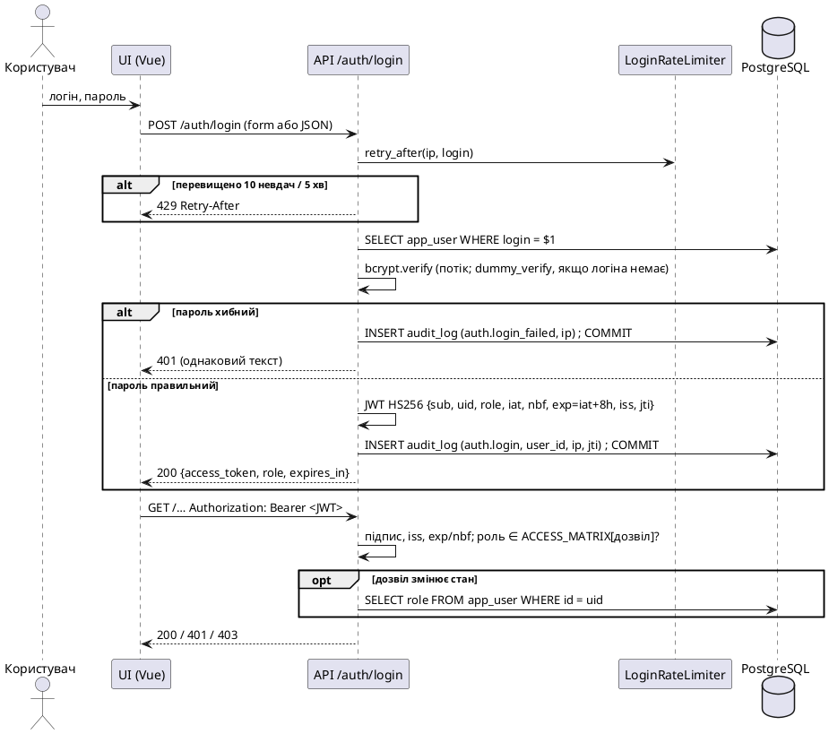

# Інформаційна безпека сервісу FuzzHelm (підрозділ 2.9 звіту, ФК14)

Автор: Андрій Жук, 2026. Код: `src/fuzzhelm/api/*`, `src/fuzzhelm/notify/telegram.py`, `src/fuzzhelm/config.py`,
ревізія `alembic/versions/0003_auth_audit.py`. Фактичний API — `docs/api/api.md`, розходження — `docs/deviations.d/api.md`.

Контекст: навчальний сервіс, **лише paper/testnet** (реальних коштів немає за побудовою), один оператор-студент і
комісія як глядачі демо. Мета розділу — показати, що типові загрози враховано й перевірено тестами, і чесно
назвати залишкові ризики.

## 1. Межі довіри

```
Браузер (Vue) ──HTTPS──▶ reverse proxy ──HTTP──▶ API (FastAPI, uvicorn) ──asyncpg, роль fuzzhelm_app──▶ PostgreSQL 16
                                                   │  ▲ LISTEN fuzzhelm_live          ▲
                                                   │  └───────────── NOTIFY ──────────┤ воркери (інжест, торговий цикл)
                                                   └──HTTPS──▶ api.telegram.org       │  ──HTTPS──▶ fapi/fstream.binance.com (read-only)
                                                                                       └─────────▶ testnet.binancefuture.com (ордери)
```
Межа 1 проходить між браузером і API: усе, що надходить із HTTP (тіла, параметри, заголовки, YAML-тексти), вважається
недовіреним. Межа 2 проходить між API і СУБД: застосунок працює роллю з мінімальними правами, а журнали лише
дописуються. Межа 3 відділяє сервіс від зовнішніх хостів: з'єднання дозволено лише з хостами allowlist.

## 2. STRIDE-модель загроз

| # | STRIDE | Загроза | Контрзахід | Перевірка |
|---|---|---|---|---|
| 1 | **S**poofing | Перебір паролів на `POST /auth/login` | bcrypt вартості 12, перевірка в окремому потоці; ≤ 10 невдалих спроб за 5 хв на IP **і** на логін → 429 + `Retry-After`; кожна спроба пишеться в `audit_log` | `test_login_rate_limited_after_repeated_failures`, `test_login_rate_limiter_window_and_reset` |
| 2 | **S**poofing | Підроблений або змінений JWT (підвищення ролі в payload, чужий ключ, `alg=none`, підміна алгоритму HS384/HS512/RS256/ES256), прострочений токен | PyJWT, лише HS256 (`algorithms=["HS256"]`), секрет з `.env`, усі 8 claims обов'язкові й типізовані, перевірка `iss`, `exp`/`iat`/`nbf` за годинником сервера, `leeway = 0` для `exp`; TTL 8 год | `test_expired_tampered_and_alg_none_tokens_are_rejected`, `test_decode_rejects_other_algorithm_other_secret_and_issuer`, `test_token_with_other_algorithm_or_alg_none_is_rejected`, `test_claims_are_required_and_typed` |
| 3 | **S**poofing / **I**nfo | Перелік логінів за текстом або часом відповіді | однаковий 401 для «немає користувача» і «хибний пароль»; для невідомого логіна виконується `dummy_verify` (той самий bcrypt) | `test_login_returns_jwt_and_role` (однакові тіла відповідей), `test_check_password_same_semantics_as_repo_authenticate` |
| 4 | **T**ampering | Зміна лімітів ризику, стратегій або зняття kill-switch роллю без права | явна матриця «дозвіл × роль»; `PUT /risk/limits` і `POST /risk/killswitch/release` — лише admin; для змін роль звіряється з БД | `test_put_risk_limits_requires_admin_role_403_for_analyst`, `test_access_matrix_enforced_for_every_route` (92 випадки) |
| 5 | **T**ampering | Шкідливий YAML стратегії: «billion laughs» через псевдоніми, `!!python/object`, шлях до файлу замість тексту, величезний документ | SafeLoader без якорів і псевдонімів; лише мапінг на верхньому рівні; ≤ 256 KiB; семантична валідація тими самими завантажувачами, що й у рушія; текст ніколи не трактується як шлях | `test_strategy_yaml_aliases_and_path_like_text_rejected`, `test_strategy_post_invalid_yaml_returns_422_with_field_path` |
| 6 | **T**ampering | SQL-ін'єкція через параметри запитів | лише параметризовані запити SQLAlchemy Core; типізовані параметри pydantic (`extra="forbid"`, межі, шаблони імен); цілі обмежені типами колонок (INT4/INT8) → 422, SQLSTATE класу 22 → 422 | огляд коду: в API немає SQL із форматуванням рядків; `test_out_of_range_integers_are_422_not_500`, `test_database_data_exception_maps_to_422_not_503` |
| 7 | **R**epudiation | «Я не змінював ліміт» / «я не знімав HALTED» | `audit_log`: `user_id`, `ip` (INET), дія, ціль, **повний JSON до і після**, пишеться в **тій самій транзакції**, що й зміна; якщо COMMIT аудиту не вдався, файл лімітів повертається до попереднього тексту | `test_limit_change_written_to_audit_log_with_before_after`, `test_limits_file_restored_when_audit_commit_fails` |
| 8 | **R**epudiation / **T**ampering | Застосунок переписує або стирає слід (аудит, журнал подій) | `REVOKE UPDATE, DELETE ON audit_log, event_journal` для `fuzzhelm_app` (ревізія 0003), API працює цією роллю | `test_limit_change_audit_before_after_is_append_only` (UPDATE/DELETE → 42501) |
| 9 | **I**nformation disclosure | Секрети в журналах, відповідях чи репозиторії (JWT secret, токен Telegram, ключі testnet) | лише `.env`/оточення (`Settings`, `SecretStr`); токен Telegram замінюється на `***` у логерах httpx/httpcore; помилки містять лише тип винятку; обробники помилок API і текст помилки прогону (`job.error`, `run.error`) не віддають деталей драйвера (SQL, параметри); токен у query-рядку SSE не підтримано | `test_token_never_logged_or_in_errors`, `test_default_services_do_not_touch_db_until_first_request` (503 без деталей), `test_backtest_failure_text_hides_driver_details` |
| 10 | **D**enial of service | Перевантаження: черга бектестів, великі відповіді, повільні SSE-клієнти, bcrypt в event loop | ≤ 8 незавершених бектестів на процес (429), рушій працює в потоці; `limit` ≤ 5000 свічок; обмежені черги SSE (256) з витісненням найстаріших; bcrypt у потоці й поза транзакцією (не тримає з'єднання пулу); межі довжин полів (YAML ≤ 256 KiB); обсяг обчислень стратегії: `defuzz.grid_nodes` ≤ 2001, ≤ 15 термів на змінну | `test_engine_backtest_service_runs_in_background_and_reports_failures`, `test_live_hub_fanout_filter_overflow_and_replay`, `test_strategy_compute_budget_is_bounded` |
| 11 | **E**levation of privilege | Користувач із пониженою роллю користується старим токеном (stateless JWT) | для всіх дозволів зміни стану роль перечитується з `app_user` на кожен запит | `test_demoted_user_loses_write_access_before_token_expiry` |
| 11a | **S**poofing / **I**nfo | Пароль нового користувача потрапляє в `ps`, історію оболонки, журнал або аудит; користувача створюють «повз» аудит | `fuzzhelm user add` бере пароль лише з `getpass` (без відлуння) або `--password-stdin` з каналу (на терміналі — відмова, бо `readline()` показує набране), прапорця `--password` немає і скорочення прапорців вимкнено; ≥ 8 символів, ≤ 72 байти; у БД — лише bcrypt; `user.create`/`user.set_role`/`user.list` пишуться в `audit_log` у тій самій транзакції (актор `cli`); останнього admin понизити не можна й під конкуренцією (`SELECT … FOR UPDATE` рядків admin) | `test_user_add_reads_password_from_stdin_never_echoes_or_logs`, `test_user_add_password_stdin_on_terminal_is_refused_not_echoed`, `test_user_add_rejects_weak_or_unhashable_passwords`, `test_user_cli_creates_bcrypt_user_audits_and_user_can_log_in`, `test_user_set_role_locks_admin_rows_against_concurrent_demotion` (integration) |
| 12 | **E**levation of privilege | Код або конфігурація спрямовує ордери на mainnet | жорсткий allowlist хостів: `ALLOWED_TESTNET_HOSTS` для виконання, `ALLOWED_READONLY_HOSTS` для даних; порушення зупиняє побудову `Settings`; Telegram — лише `api.telegram.org` | `test_mainnet_host_is_rejected_by_config`, `test_base_url_must_be_telegram_https_host` |

## 3. Матриця доступу «ендпоінт × роль»

Ролі: **op** — operator, **an** — analyst, **au** — auditor, **ad** — admin. `*` позначає дозвіл на зміну стану:
для нього роль перевіряється ще й за БД.

| Метод | Шлях | Дозвіл | op | an | au | ad |
|---|---|---|:-:|:-:|:-:|:-:|
| POST | `/auth/login` | — (публічний) | ✓ | ✓ | ✓ | ✓ |
| GET | `/auth/me` | `self:read` | ✓ | ✓ | ✓ | ✓ |
| GET | `/market/candles`, `/market/health`, `/dq/score` | `market:read` | ✓ | ✓ | ✓ | ✓ |
| GET | `/strategies`, `/strategies/{name}`, `/strategies/{name}/versions/{version}` | `strategy:read` | ✓ | ✓ | ✓ | ✓ |
| POST/PUT | `/strategies`, `/strategies/{name}`, `/strategies/{name}/activate` | `strategy:write` * | ✓ | ✗ | ✗ | ✓ |
| POST | `/backtests` | `backtest:run` * | ✓ | ✓ | ✗ | ✓ |
| GET | `/runs`, `/runs/{id}`, `/runs/{id}/metrics`, `/runs/{id}/equity` | `run:read` | ✓ | ✓ | ✓ | ✓ |
| GET | `/decisions/{id}/explain` | `decision:read` | ✓ | ✓ | ✓ | ✓ |
| GET | `/risk/state`, `/risk/events`, `/risk/limits` | `risk:read` | ✓ | ✓ | ✓ | ✓ |
| PUT | `/risk/limits` | `risk:limits:write` * | ✗ | ✗ | ✗ | ✓ |
| POST | `/risk/killswitch/release` | `risk:killswitch:release` * | ✗ | ✗ | ✗ | ✓ |
| GET | `/stream/live` | `stream:read` | ✓ | ✓ | ✓ | ✓ |
| GET | `/audit` | `audit:read` | ✗ | ✗ | ✓ | ✓ |

Обґрунтування:
* **Читання даних, стратегій, прогонів, рішень, ризику й потоку доступне всім чотирьом ролям.** Брифінг задає
  «analyst+». При чотирьох ролях ієрархія неоднозначна: аудитор ні «вищий», ні «нижчий» за оператора. Тому замість
  ієрархії використано таблицю, а «analyst+» прочитано як «кожна автентифікована роль».
* **Зміна стратегій — operator** (брифінг) **і admin**, бо адміністратор має всі права оператора.
* **Ліміти ризику й зняття kill-switch — лише admin** (брифінг §5.12, §8.1). Автомат станів додатково вимагає
  `Role.ADMIN` у `RiskStateMachine.release`.
* **Запуск бектесту створює прогін**, тобто змінює стан. Його дозволено всім, крім auditor: аудитор лише читає і
  не створює артефактів, які сам же перевіряє (розділення обов'язків).
* **Журнал аудиту доступний лише auditor і admin.** Він містить IP і user_id, тому діє принцип мінімальних
  привілеїв. Без цього маршруту роль auditor не мала б власного призначення.

Таблиця збігається з кодом: її згенеровано з `ACCESS_MATRIX` і маршрутів застосунку. Тест
`test_access_matrix_enforced_for_every_route` перевіряє кожну клітинку (23 пари «метод × шлях» × 4 ролі),
а `test_every_route_is_protected_or_explicitly_public` — що нового маршруту без дозволу не з'явиться.

## 4. Автентифікація (sequence для звіту)



## 5. Аудит дій

Кожна дія, що змінює стан, пишеться в `audit_log` у **тій самій транзакції**, що й сама зміна: немає зміни без
сліду і немає сліду без зміни.

| `action` | Коли | before | after |
|---|---|---|---|
| `auth.login` / `auth.login_failed` | кожна спроба входу | — | роль, `jti`, `expires_at_s` / введений логін |
| `strategy.create` / `strategy.update` | POST / PUT `/strategies` | остання версія + активна | нова версія (хеш, кількість правил) |
| `strategy.activate` | активація версії | попередня активна версія | нова активна |
| `backtest.submit` | POST `/backtests` | — | `run_id` + повна специфікація запуску |
| `risk.limits.update` | PUT `/risk/limits` | **повна** стара конфігурація | **повна** нова + `_changed` + `_sha256_before` |
| `risk.killswitch.release` | POST `/risk/killswitch/release` | спостережений стан, `run_id` | команда, причина, `run_id` |
| `user.create` | `fuzzhelm user add` (CLI) | — | `id`, `login`, `role`, `_actor = {login: "cli", role: null, os_user}` (пароля й хеша немає) |
| `user.set_role` | `fuzzhelm user set-role` (CLI) | `id`, `login`, стара роль | нова роль, `_actor` |
| `user.list` | `fuzzhelm user list` (CLI) | — | кількість користувачів, `_actor` |

Дії CLI мають `user_id = NULL` (виконавець — не користувач API) і `ip = NULL`; хто саме запускав команду, видно з
`_actor.os_user` (обліковий запис ОС).

IP береться з `request.client.host` і пишеться в колонку типу INET. Заголовку `X-Forwarded-For` не довіряємо,
бо його підробляє будь-який клієнт. За reverse proxy uvicorn запускається з
`--proxy-headers --forwarded-allow-ips=<ip проксі>`, і тоді `client.host` уже правильний.

## 6. Керування секретами

* Секрети задаються лише через оточення або `.env` (у `.gitignore`); `.env.example` не містить жодного справжнього
  значення. Їх читає `fuzzhelm.config.Settings`: `jwt_secret`, `telegram_bot_token`, `binance_testnet_key/secret`
  мають тип `SecretStr`, тож у `repr` і журналах вони не з'являються.
* Якщо `FUZZHELM_JWT_SECRET` лишився типовим (`dev-only-change-me`, `change-me`, порожній) або коротший за 32
  символи (`main.weak_jwt_secret`), під час старту API виводиться попередження. Для розгортання потрібен випадковий секрет ≥ 32 байти, напр.
  `python -c "import secrets; print(secrets.token_urlsafe(48))"` **[ЛЮДИНА]**.
* Токен Telegram присутній лише в URL запиту Bot API. На логери `httpx`/`httpcore` ставиться фільтр, що замінює
  його на `***`, а тексти помилок містять тільки тип винятку (тест `test_token_never_logged_or_in_errors`).
* JWT передається лише в заголовку `Authorization`, у query-рядку — ні: інакше він потрапив би в журнали доступу
  проксі й uvicorn.
* Паролі зберігаються лише як bcrypt-хеші (вартість 12). Паролі довші за 72 байти відхиляються: bcrypt мовчки
  обрізав би решту.

## 7. Валідація вхідних даних як межа довіри

* Усі тіла запитів — pydantic-моделі з `extra="forbid"`, межами довжин і значень та шаблонами імен
  (`^[A-Za-z0-9_.-]+$` для стратегій). Параметри бектесту перевіряє окрема схема `BacktestParams`, невідомий ключ
  дає 422.
* YAML стратегій проходить три фільтри: (1) розмір ≤ 256 KiB; (2) `SafeLoader` без якорів і псевдонімів, лише
  мапінг на верхньому рівні; (3) семантику, тобто ті самі завантажувачі, що й у рушія (45 правил, повнота
  комбінацій, існування термів, `w = 1`). Помилка дає 422 з точним шляхом (`rules[3].if.T`). Текст ніколи не
  передається завантажувачу як рядок, що може виявитися шляхом: `fuzzy.read_yaml_source` сприйняв би
  однорядковий `….yaml` як файл сервера.
* Цілі параметри шляхів, запитів і тіл обмежені типами колонок DDL §6 (INT4 для ідентифікаторів `SERIAL` і версій,
  INT8 для `decision_id`, `seed` і часу в нс): завелике число дає 422 з точним `loc`, а не 503 від драйвера чи 500
  від `datetime`. Страховка для нових параметрів: SQLSTATE класу 22 (data exception) обробник теж перетворює на 422
  (API-16).
* Обсяг обчислень, який задає текст стратегії, обмежено (`validation.check_resource_limits`): завантажувач fuzzy
  перевіряє `defuzz.grid_nodes` лише знизу, тож `grid_nodes: 1000000000` зберігся б і вичерпав пам'ять на першому
  `/explain`. Межа — 2001 вузол (найдрібніша сітка дослідження збіжності) і 15 термів на змінну.
* Ліміти ризику: тіло проходить `risk.config.load_risk_config` (порядок порогів, κ ∈ [0, 1], …) **до** запису
  файлу. На диск потрапляє лише текст, який той самий валідатор прочитає назад.
* Payload NOTIFY перевіряється і при кодуванні (≤ 7900 байт, однорядковий `kind`), і при декодуванні: сміття
  відкидається, а не валить процес.

## 8. Транспорт, заголовки, allowlist

* HTTPS термінується на reverse proxy (Fly.io / nginx). API не приймає прямих з'єднань ззовні.
* На кожну відповідь додаються `X-Content-Type-Options: nosniff`, `X-Frame-Options: DENY`,
  `Referrer-Policy: no-referrer`, `Cache-Control: no-store`. CORS дозволено лише для origin UI (типово
  `http://localhost:5173`), без cookies (`allow_credentials=False`, бо токен передається в заголовку).
* Allowlist хостів: ордери йдуть лише на `testnet.binancefuture.com` / `demo-fapi.binance.com`, ринкові дані
  беруться лише з публічних read-only хостів Binance/Kraken, нотифікації — лише на `api.telegram.org`. Порушення
  зупиняє побудову `Settings` (`MainnetHostRejected`).

## 9. Аудит залежностей (`pip-audit`)

Команда `uv run pip-audit` (pip-audit 2.10.1), виконана 2026-09-19 у середовищі проєкту (з мережею):

```
Found 2 known vulnerabilities in 1 package
Name  Version ID              Fix Versions
----- ------- --------------- ------------
ecdsa 0.19.2  PYSEC-2026-1325
ecdsa 0.19.2  PYSEC-2026-1325

Name     Skip Reason
-------- -----------------------------------------------------------------------
fuzzhelm Dependency not found on PyPI and could not be audited: fuzzhelm (0.1.0)
```

Рецензент повторив `uv run pip-audit` того ж дня (pip-audit 2.10.1): вивід той самий.

Висновок: `ecdsa` — транзитивна залежність `python-jose` 3.5.0 (`uv tree --invert --package ecdsa`). Уразливість
PYSEC-2026-1325 — часова атака Minerva на **підпис** ECDSA P-256 (`SigningKey.sign_digest`). Виправленої версії
немає: проєкт python-ecdsa вважає side-channel атаки поза своїм обсягом. FuzzHelm підписує токени лише **HMAC
HS256**, а список `algorithms=["HS256"]` у `decode_token` не дає використати ECDSA-ключі, тож уразливий код не
виконується. Пакет `fuzzhelm` пропущено, бо його немає в PyPI (це сам проєкт).

**Хвиля 3 (API-13 → PLAT-04): код переведено на PyJWT.** `fuzzhelm.api.auth` і тести імпортують лише `jwt`
(PyJWT 2.14.0); `grep -rn jose src tests scripts` у Python-коді знаходить тільки згадку в докстрінгу. Проте
`python-jose` ще лишається в `dependencies` `pyproject.toml`/`uv.lock` (їх змінює провідний розробник, не цей
компонент), тож `uv tree --invert --package ecdsa` на 2026-09-19 досі показує `ecdsa v0.19.2 ← python-jose v3.5.0 ←
fuzzhelm`, і `pip-audit` виводитиме той самий запис. **Рекомендація PYSEC-2026-1325 зникне, щойно `python-jose`
буде вилучено із залежностей** (`uv remove python-jose`) — PyJWT для HS256 не тягне ні `ecdsa`, ні `cryptography`.
Після вилучення треба повторити `uv run pip-audit` і вписати сюди фактичний вивід (до того часу не вигадувати).

## 10. Залишкові ризики (чесно)

1. **Stateless JWT.** Для читання відкликаний або понижений користувач зберігає доступ до кінця TTL (≤ 8 год).
   Для змін стану роль перечитується з БД. Списку відкликаних `jti` немає.
2. **Обмежувач входів працює в пам'яті одного процесу.** Кілька реплік API ділять ліміт між собою. Для демо
   (один процес) цього досить.
3. **Роль `fuzzhelm_app` через `make_engine(role=…)` — захист від помилок коду, а не межа безпеки.** Власник
   з'єднання може виконати `SET ROLE` назад (ST-02). Справжню межу дає окрема LOGIN-роль `IN ROLE fuzzhelm_app`
   **[ЛЮДИНА]**.
4. **Невдалі входи зберігають введений логін** (до 128 символів) в `audit_log`. Це корисно для розслідування
   перебору, але якщо користувач помилково введе пароль у поле логіна, він потрапить у журнал. Для демо ризик
   прийнято.
5. **Файл лімітів — стан однієї машини.** Кілька реплік API з окремими файловими системами розійшлися б.
   Розгортання — одна репліка (брифінг §9).
6. **Черга бектестів не переживає рестарт процесу.** Прогін, перерваний падінням процесу, лишається в `run` зі
   статусом RUNNING (API-08).
